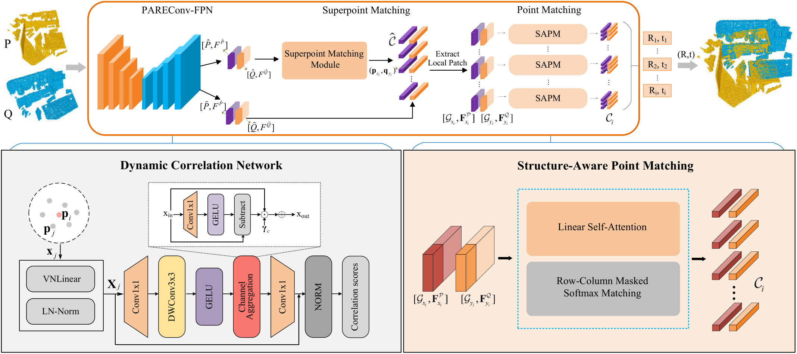
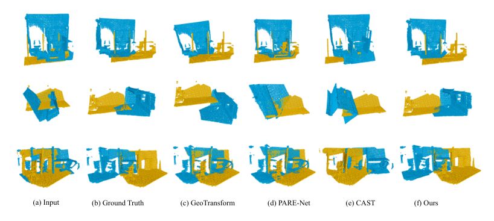
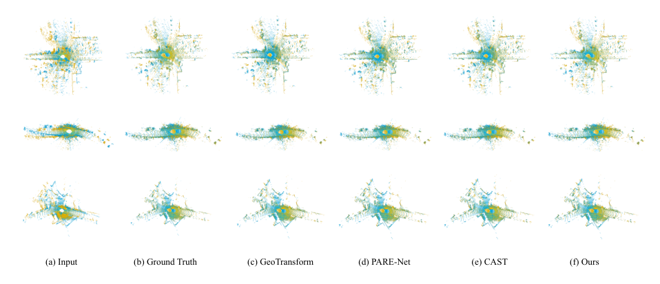
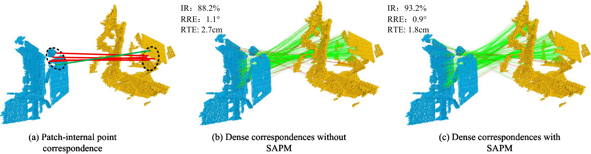

# Dynamic Correlation Network and Structure-Aware Matching for Robust Point Cloud Registration

This repository contains the official implementation of the paper *Dynamic Correlation Network and Structure-Aware Matching for Robust Point Cloud Registration*, by Lei Lu, Meichen Pan, Ling Cao, Renlong Qi, Peng Li, and Wei Pan, published in *Computers & Graphics* (2026).

## 🧠 Method Overview

Relative rotations between point clouds make correspondence estimation
unreliable, and data augmentation alone cannot adequately cover the continuous
SO(3) rotation space — which often leads to unstable matching under unseen
orientations. We propose a **rotation-robust, coarse-to-fine** registration
framework that models consistent feature correlations in a rotation-invariant
space and estimates the rigid transformation **without RANSAC**. It has two key
components: a **Dynamic Correlation Network (DCN)** and a **Structure-Aware
Point Matching (SAPM)** module.



> A PARECon-FPN backbone augmented with a Dynamic Correlation Network extracts
> rotation-robust multi-scale features, yielding coarse superpoints and dense
> point-level descriptors. Coarse superpoint correspondences define local
> patches, within which SAPM establishes dense correspondences. Multiple rigid
> transformation hypotheses are estimated via SVD, and the optimal solution is
> selected as the final transformation (no RANSAC).

**Pipeline.**

1. **DCN-augmented PARECon-FPN backbone.** The source and target clouds are
   processed by a weight-sharing (Siamese) vector-neuron (VN) equivariant
   encoder–decoder. It produces *rotation-equivariant* features (which preserve
   orientation for transformation estimation) and *rotation-invariant*
   descriptors at two levels: coarse **superpoints** for coarse-level matching,
   and dense point-level features for fine-grained matching.
2. **Dynamic Correlation Network (DCN).** Instead of PAREConv's fixed,
   MLP-based kernel aggregation with static parameterization, DCN formulates
   correlation as a *dynamic, structure-conditioned* process in the
   rotation-invariant feature space. It derives stable geometric relationships
   from invariant descriptors and applies channel-aware and spatial weighting,
   yielding geometry-adaptive, rotation-robust convolution and more consistent,
   discriminative correlations under arbitrary rotations.
3. **Superpoint matching.** GeoTransformer-style self- and cross-attention
   matches superpoints to form coarse correspondences, each of which defines a
   pair of local patches.
4. **Structure-Aware Point Matching (SAPM).** Within each patch, SAPM refines
   dense correspondences using efficient **linear self-attention** (avoiding the
   quadratic cost of standard attention) to capture local contextual
   dependencies, then enforces **bidirectional consistency** through a
   row–column masked softmax, suppressing unstable matches.
5. **RANSAC-free pose estimation.** Dense correspondences aggregated from all
   patches form a correspondence set, from which multiple rigid-transformation
   hypotheses are computed via SVD-based orthogonal Procrustes; a feature-based
   hypothesis proposer then selects the final transformation `T = {R, t}`.

**Contributions.**

- A **Dynamic Correlation Network (DCN)** that performs adaptive correlation
  modeling in a rotation-invariant feature space, enabling robust and consistent
  feature correlations under arbitrary rotations.
- A lightweight **Structure-Aware Point Matching (SAPM)** module that captures
  contextual dependencies and enforces bidirectional consistency, improving the
  reliability of fine-grained correspondences.
- A unified coarse-to-fine framework, validated on the indoor **3DMatch /
  3DLoMatch** and outdoor **KITTI** benchmarks, achieving superior accuracy and
  robustness under varying rotations compared with state-of-the-art methods.

## 📊 Results

All numbers are taken from the paper. **Bold** = best, *italic* = second best.

### Indoor — 3DMatch / 3DLoMatch (Registration Recall, %)

| Model | Estimator | Samples | 3DMatch | 3DLoMatch |
|---|---|---|---|---|
| FCGF | RANSAC | 5000 | 85.1 | 40.1 |
| D3Feat | RANSAC | 5000 | 81.6 | 37.2 |
| SpinNet | RANSAC | 5000 | 88.6 | 59.8 |
| Predator | RANSAC | 5000 | 89.0 | 59.8 |
| CoFiNet | RANSAC | 5000 | 89.3 | 67.5 |
| RIGA | RANSAC | 5000 | 89.3 | 65.1 |
| RoITr | RANSAC | 5000 | 91.9 | 74.7 |
| RoReg | RANSAC | 5000 | 92.9 | 70.3 |
| BUFFER | RANSAC | 5000 | 92.9 | 71.8 |
| CAST | RANSAC | – | *95.2* | *75.1* |
| Cross-PCR | RANSAC | 5000 | 94.5 | 73.7 |
| BUFFER-X | RANSAC | 5000 | **95.6** | 74.2 |
| **Ours** | RANSAC | 5000 | *95.2* | **79.3** |
| GeoTransformer | LGR | all | 91.5 | 74.0 |
| PEAL | LGR | all | 94.2 | 78.8 |
| DCATr | LGR | all | 92.1 | 75.7 |
| DFAT | LGR | all | 94.9 | 76.8 |
| **Ours** | LGR | all | **95.0** | *78.9* |
| PARENet | FHP | all | 94.9 | 79.3 |
| **Ours** | FHP | all | **95.4** | **79.6** |

### Outdoor — KITTI

| Model | Publication | RTE (cm) | RRE (°) | RR (%) |
|---|---|---|---|---|
| 3DFeat-Net | ECCV 2018 | 25.9 | 0.25 | 96.0 |
| FCGF | ICCV 2019 | 9.5 | 0.30 | 96.6 |
| D3Feat | CVPR 2020 | 7.2 | 0.30 | 99.8 |
| SpinNet | CVPR 2021 | 9.9 | 0.47 | 99.1 |
| Predator | CVPR 2021 | 6.8 | 0.27 | 99.8 |
| CoFiNet | NeurIPS 2021 | 8.2 | 0.41 | 99.8 |
| GeoTransformer | CVPR 2022 | 6.8 | 0.24 | 99.8 |
| BUFFER | CVPR 2023 | 7.1 | 0.26 | 99.8 |
| PEAL | CVPR 2023 | 6.8 | 0.23 | 99.8 |
| DCATr | CVPR 2024 | 6.6 | *0.22* | 99.7 |
| PARENet | ECCV 2024 | 5.4 | 0.24 | 99.8 |
| CAST | NeurIPS 2024 | **2.5** | 0.27 | **100.0** |
| PPT | TCSVT 2025 | 6.3 | 0.23 | 99.8 |
| UGP | CVPR 2025 | 7.1 | 0.24 | 99.8 |
| **Ours** | – | *4.8* | **0.21** | 99.8 |

Our method attains the lowest rotation error (RRE) among all compared methods.

### Robustness to arbitrary rotations — 3DLoMatch vs. Rotated 3DLoMatch

Superscript = change in Transformation Recall (TR) after applying random
rotations (smaller drop = more robust). `*` marks rotation-invariant/equivariant
designs.

| Method | RRE (°) | RTE (cm) | TR (%) | RRE (°) | RTE (cm) | TR (%) |
|---|---|---|---|---|---|---|
| | **3DLoMatch** | | | **Rotated 3DLoMatch** | | |
| FCGF | 4.84 | 12.87 | 39.6 | 4.74 | 13.39 | 24.5 (−15.1) |
| Predator | 3.61 | 10.65 | 65.6 | 3.55 | 10.30 | 64.0 (−1.6) |
| GeoTransformer | 2.91 | 8.71 | 75.4 | 2.94 | 8.85 | 72.6 (−2.8) |
| PEAL | *2.84* | **8.64** | *81.2* | *2.86* | **8.53** | *78.7* (−2.5) |
| YOHO* | 3.54 | 10.34 | 66.6 | 3.61 | 10.16 | 67.1 (+0.5) |
| RoITr* | 2.95 | 9.03 | 75.1 | 2.97 | 9.08 | 75.5 (+0.4) |
| PARENet* | 2.87 | 8.83 | 81.3 | 2.84 | 8.71 | 81.8 (+0.5) |
| **Ours*** | **2.78** | *8.65* | **82.3** | **2.75** | *8.53* | **82.7** (+0.4) |

Our method achieves the best TR on both settings with a minimal change under
rotation, demonstrating strong robustness to unseen orientations.

### Qualitative results

Registration on 3DMatch / 3DLoMatch (indoor):



Registration on the KITTI odometry dataset (outdoor):



Dense correspondences and matching behavior:



## 🔧  Installation

Please use the following command for installation.

```bash
# It is recommended to create a new environment
conda create -n pareconv python==3.8
conda activate pareconv


pip install torch==1.13.0+cu116 torchvision==0.14.0+cu116 torchaudio==0.13.0 --extra-index-url https://download.pytorch.org/whl/cu116

# Install packages and other dependencies
pip install -r requirements.txt
python setup.py build develop

cd pareconv/extensions/pointops/
python setup.py install
```

Code has been tested with Ubuntu 18.04, GCC 7.5.0, Python 3.9, PyTorch 1.13.0, CUDA 11.6 and cuDNN 8.0.5.

## 💾 Dataset and Pre-trained models
we provide pre-trained models in [Google Drive](https://drive.google.com/file/d/1jrPejtxnhMwtlr6LxXNJznm0BxSXP1eY/view?usp=drive_link). Please download the latest weights and put them in `pretain` directory.


Moreover, [3DMatch](https://drive.google.com/file/d/1_6tW-DREQdpGi4idLin8yITHuS_qXXnw/view?usp=drive_link) and [KITTI](https://drive.google.com/file/d/11OtJHWtX5y5dko2SiI3jCmw9zX305rJz/view?usp=drive_link) datasets can be downloaded from Google Drive or [Baidu Disk](https://pan.baidu.com/s/1mgqaelsAaV5Jx8o8nAseWQ) (extraction code: qyhn). 

##### 3DMatch should be organized as follows:
```text
--your_3DMatch_path--3DMatch
              |--train--7-scenes-chess--cloud_bin_0.pth
                    |--     |--...         |--...
              |--test--7-scenes-redkitchen--cloud_bin_0.pth
                    |--     |--...         |--...
              |--train_pair_overlap_masks--7-scenes-chess--masks_1_0.npz
                    |--     |--...         |--...       
```

Modify the dataset path in `experiments/3DMatch/config.py` to
```python
_C.data.dataset_root = '/your_3DMatch_path/3DMatch'
```

##### KITTI should be organized as follows:
```text
--your_KITTI_path--KITTI
            |--downsampled--00--000000.npy
                    |--...   |--... |--...
            |--train_pair_overlap_masks--0--masks_11_0.npz
                    |--...   |--... |--...
```                   

Modify the dataset path in `experiments/KITTI/config.py` to
```python
_C.data.dataset_root = '/your_KITTI_path/KITTI' 
```

## ⚽ Demo
After installation, you can run the demo script in `experiments/3DMatch` by:
```bash
cd experiments/3DMatch
python demo.py
```

To test your own data, you can downsample the point clouds with 2.5cm and specify the data path:
```bash
python demo.py --src_file=your_data_path/src.npy --ref_file=your_data_path/ref.npy --gt_file=your_data_path/gt.npy --weights=../../pretrain/3dmatch.pth.tar
```

## 🚅 Training
You can train a model on 3DMatch (or KITTI) by the following commands:

```bash
cd experiments/3DMatch (or KITTI)
CUDA_VISIBLE_DEVICES=0 python trainval.py
```
You can also use multiple GPUs by:
```bash
CUDA_VISIBLE_DEVICES=GPUS python -m torch.distributed.launch --nproc_per_node=NGPUS trainval.py
```
For example,
```bash
CUDA_VISIBLE_DEVICES=0,1 python -m torch.distributed.launch --nproc_per_node=2 trainval.py
```

## ⛳ Testing
To test a pre-trained models on 3DMatch, use the following commands:
```bash
# 3DMatch
python test.py --benchmark 3DMatch --snapshot ../../pretrain/3dmatch.pth.tar
python eval.py --benchmark 3DMatch
```
To test the model on 3DLoMatch, just change the argument `--benchmark 3DLoMatch`.

To test a pre-trained models on KITTI, use the similar commands:
```bash
# KITTI
python test.py --snapshot ../../pretrain/kitti.pth.tar
python eval.py
```


## 📑 Citation
If you find this work useful, please cite:
```bibtex
@article{lu2026dcsam,
  title   = {Dynamic correlation network and structure-aware matching for robust point cloud registration},
  author  = {Lu, Lei and Pan, Meichen and Cao, Ling and Qi, Renlong and Li, Peng and Pan, Wei},
  journal = {Computers \& Graphics},
  year    = {2026},
  doi     = {10.1016/j.cag.2026.104672}
}
```
